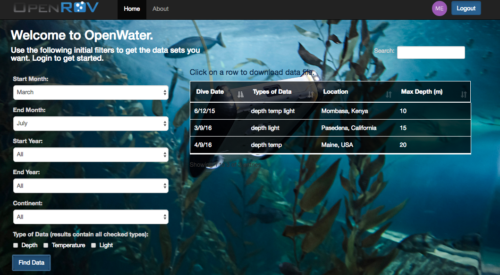

# Open Water Website
Thank you for your interest in OpenWater. This project came to life when we realized that the OpenROV community is, and has been, unintentionally collecting large amounts of fine-grain coastal thermocline data around the world, when flying their ROVs. This made us wonder, how can we best put this data to use? Our solution is a platform in which scientists, government agencies, NGOs, and others can search for data sets collected by citizen scientists, to study and monitor the water column in real time. Having data available would be invaluable for environmental management purposes, or to use it to help inform legislators and congress members about changing ocean conditions and how best to adapt to them. Not only will this project scale the data collection process, but it will do so for free.

Features currently include the ability to: apply initial filters based on what data sets you’re interested in, sort the resultant data (based on date, max depth, types of data, and location), search for a specific date, type of data, location, or max dive depth, and download a data file (as a csv) with a single click (the data file will contain much more information: the gps coordinates, user’s notes on the weather, the sensor’s specs, the actual data, etc).

Soon to come features include the ability to view all the data sets on a map (based on GPS coordinate), processed data, and preview images.

